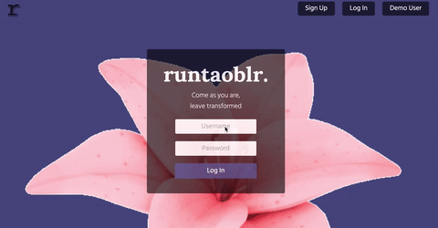
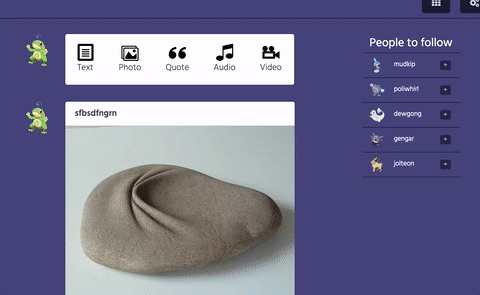
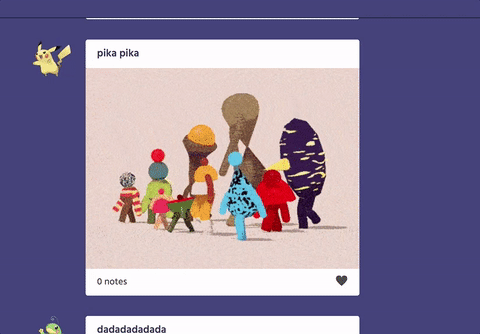
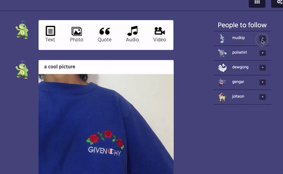
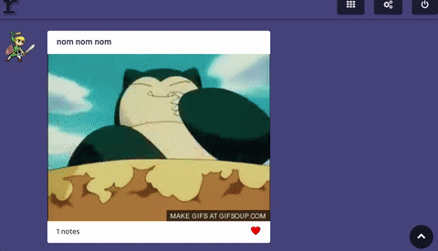
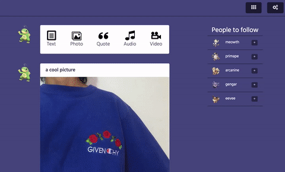

# **Runtaoblr**

Live: [Runtaoblr](runtaoblr.herokuapp.com)

Runtaoblr is a full-stack web app inspired by Tumblr built using Ruby on Rails and PostgreSQL on the back-end and JS with React and Redux on the front-end.

## **Features and Implementation**

### Dashboard
The dashboard is the aggregate of all the user's posts with the posts of the user's followed blogs, ordered chronologically. The dashboard features infinite scrolling, and a back to top button that appears after having scrolled down. Each post is a React component, and the overall Redux store keeps track of all the individual posts states. Furthermore, a user can edit his/her own post within the feed.

### Posts
The user can post multiple forms of media. Text and quotes are stored as strings. Images. Videos and audio currently can only be added from urls, and are imbedded in the post. Posts are stored in one table in the database, although I may consider having a table for each type of media later on, which would allow uploads of audio and video content.

### Likes
Users can like other posts, and notes keep track of the likability of each post. A join table keeps track of which users like which posts.

### Follows
Users can follow/unfollow other users from the suggested sidebar, the newsfeed avatar, and from user blog pages. A join table keeps track of which users follow whom.

### Blog Display
Every user has a blog page that contains all their posts. Other users can access and view these pages by clicking on each respective user's avatar, username on the sidebar, or just by typing in runtaoblr.com/[username]. This is down with the React router library. This then translates a query to a ReSTful route with show action.

### User Settings
Users can change their username, profile description, profile picture, and blog cover photo. This is easily accessed from the dashboard.

## **Future Directions**
**Reblogs**
A core feature that makes Tumblr media go viral is the ability to make instant "reblog" posts. I plan to implement this by creating posts with tree structures and recursion.

**Explore**
Tumblr also suggests posts and blogs to follow based on a user's blogging behavior (post content, followed blog similarities). I plan on studying social networking and implement a suggested media feature.
<!-- ## **Minimum Viable Product**

 By W9D5, I will have successfully implemented the following features with smooth navigation, no bugs, a plethora of seed data and awesome CSS styling (this was heavily appropriated from the sample):

- [x] Hosting on Heroku
- [x] New account, login, and guest/demo login
- [x] Posts form for various post types
- [x] Feed/dashboard
- [x] Follows
- [x] Likes
- [x] Account settings
- [ ] **BONUS** Infinite scroll on dashboard
- [ ] **BONUS** User show pages
- [ ] **BONUS** Explore/Search
- [ ] **BONUS** Reblog (think about doing recursion)
- [ ] **BONUS** tags
more if there's time:

# Implementation Timeline

## Phase 1: Back End Setup and Front End User Authentication + CSS Styling (2 days)

**Objectives**
1. Functioning rails backend db created
2. Complete front end Authentication
3. Style them correctly

## Phase 2a: Make Posts (1 day, 3 so far)
**Objectives**
1. Users can create and edit posts
2. Display total amount of posts on sidebar

## Phase 2b: Allow follows and followers; Build Feed (1 day, 4 so far)
**Objectives**
1. Users can follow other users
2. Users can see who they follow
3. Users can see who follow them
4. Follow button
5. Users can see the posts of the people they follow in chronological order
6. style correctly

## Phase 2c: Finish Feed and Implement likes (1 day, 5 so far)
**Objectives**
1. Users can see follower's posts (feed)
2. Users can like each others posts
3. Set up likes show page
4. Style them correctly

## Phase 3: Reblogs (1 day, 6 so far)
**Objectives**
1. Implement Reblogs
2. have total count on reblog chain
3. have nested reblog content

**Bonuses**

## Phase 4: User Settings  (1, 7 so far)
**Objectives**
1. User can set user settings (profile pic, cover photo, description)
2. Hover account info in Dashboard header
6. Displayed properly on user show page

## Phase 4: User Show page and hover short blog description, implement infinite scroll (1 day, 8 so far)
**Objectives**
1. Create default show page for a user
2. Set and edit user information
3. Implement hover preview feature in dashboard
4. Add infinite scroll to dashboard

## Phase 5: Final touches/CSS (1 day, 9 total)
**objectives**
- Proofread
- edit -->
